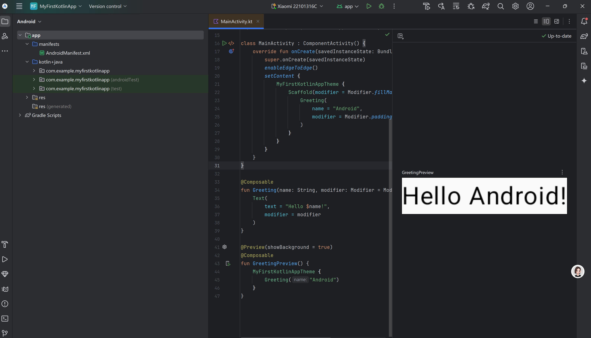
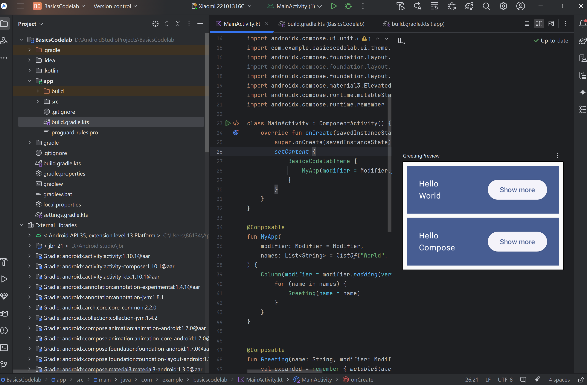

# 软件实践项目实验报告：构建Kotlin应用并使用Compose布局
## 一、基本信息
- **专业**：软件工程
- **班级**：软工一班
- **学号**：121052022012
- **姓名**：毛展濠
- **实验日期**：2025年4月27日

## 二、实验内容
### （一）学习基于Kotlin语言的Android开发
本次实验聚焦于Kotlin语言在Android开发中的应用，通过完成一系列任务来深入理解和掌握相关开发技能。
### （二）具体任务
1. **任务一：构建首个Kotlin APP**：在创建项目时，选择“Empty Activity”模板，编程语言指定为Kotlin。为应用程序命名，并将最小支持的API Level设置为21，这是Compose支持的最低版本。之后，严格按照CSDN发布的教程步骤逐步完成项目构建。
2. **任务二：实践Compose布局**：运用Jetpack Compose组件进行Android应用的界面布局。同样依据CSDN上的教程，按步骤完成项目构建工作，确保Compose布局在应用中得以正确实现。

## 三、实验目的
1. **掌握Kotlin开发Android的基本流程**：通过亲手构建Kotlin APP，熟悉从创建项目、配置环境到编写代码实现基本功能的一整套开发流程，包括项目结构的理解、文件的创建与编辑、依赖的配置等方面。
2. **掌握Compose布局的基本用法**：学会使用Jetpack Compose提供的各种布局组件和修饰符，能够根据设计需求进行灵活的界面布局，如设置组件的位置、大小、间距等属性。
3. **熟悉Kotlin语言的特性**：在实验过程中，频繁使用Kotlin语言进行代码编写，进一步加深对Kotlin语言的语法、函数式编程特性、空安全机制等方面的理解和运用能力。

## 四、实验过程
1. **创建首个Kotlin应用**：打开Android开发工具，在新建项目界面中，从众多模板里选择“Empty Activity”，并在语言选项中选定Kotlin。为应用程序取合适的名称，同时将最小支持的API Level设置为21。创建完成后，项目结构中生成了如`MainActivity.kt`、`strings.xml`等关键文件。在`MainActivity.kt`文件中，定义了`MainActivity`类，它继承自`ComponentActivity`。同时，编写了可组合函数`Greeting`，用于显示带有特定名字的问候语。`@Preview`注解的`GreetingPreview`函数，则方便在开发环境中实时预览`Greeting`函数的显示效果。
 
2. **实践Compose布局**：根据CSDN教程，在已创建的项目基础上，引入Jetpack Compose相关依赖。接着，在布局文件中使用Compose的各种布局组件，如`Column`、`Row`、`Box`等，按照设计要求对界面元素进行排列组合。利用修饰符`Modifier`来调整组件的大小、边距、背景颜色等属性，实现了预期的界面布局效果，如将“Hello World”“Show more”“Hello Compose”等元素合理布局在界面上。
  
## 五、实验结果
成功完成了首个Kotlin APP的构建，应用程序能够正常运行，并且正确显示了`Greeting`函数中的问候语。在Compose布局实践方面，实现了符合预期的界面布局，各个组件的位置、样式等均达到设计要求，成功运用Compose布局技术为应用程序打造出了美观、合理的用户界面。

## 六、实验总结
通过本次实验，我在Kotlin语言开发Android应用以及Compose布局的运用方面取得了显著的进步。不仅熟练掌握了Kotlin开发Android的基本流程，还深入理解了Compose布局的原理和用法，能够根据实际需求进行灵活的界面设计。同时，在实验过程中遇到了一些问题，如依赖配置错误、布局组件属性设置不当等，但通过查阅资料和不断调试，最终都得到了解决，这也进一步提升了我的问题解决能力和开发技能。未来，我将继续深入学习Kotlin和Compose相关知识，探索更多高级功能和应用场景，为开发更复杂、更优质的Android应用奠定坚实的基础。 
